<div align="center">


**Высокодоступный пул MTProto-прокси.** Регистратор следит за здоровьем нод,
верифицирует доступность извне и держит A-записи ваших доменов
на живых нодах через Cloudflare DNS — автоматически, 24/7.


<br>
<br>

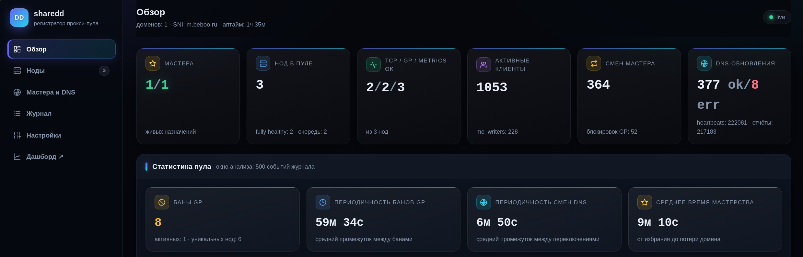

<!-- 📸 HERO-СКРИНШОТ: панель → «Обзор» (KPI-стрип + статистика пула).
 Сохраните как docs/screenshots/hero-panel.png — картинка подтянется сама.
 Имена и пути всех остальных скриншотов даны в таких же комментариях по тексту. -->

</div>

---

## Содержание

- [Что это такое](#-что-это-такое)
- [Ключевые возможности](#-ключевые-возможности)
- [Как это работает](#-как-это-работает)
- [Веб-интерфейсы и функции панели](#-веб-интерфейсы)
- [Установка](#-установка)
- [Конфигурация](#-конфигурация)
- [FAQ](#-faq)

---

## 🤔 Что это такое

Вы держите несколько VPS с MTProto-прокси ([telemt](https://github.com/telemt/telemt),
 [MTProxyL](https://github.com/Liafanx/MTProxyL/) или [MEKO fix](https://github.com/Mekotofeuka/MTPROTO_FIX_By_MEKO) и раздаёте доступ по доменам вроде `mtp1.example.com`. Рано или поздно
IP очередной ноды попадает под блокировку — и домен превращается в тыкву:
пользователи тычутся в мёртвый адрес, пока вы руками не переключите DNS.

**sharedd делает это за вас.** Регистратор постоянно проверяет каждую ноду
(свои TCP-пробы + метрики telemt + независимые внешние проверки через
[Globalping](https://globalping.io) из РФ-площадок) и мгновенно переключает
домены заблокированных/упавших нод на живые. Клиентов «на блок» больше нет:
каждый managed-домен в любой момент указывает на здоровую ноду.

Один регистратор — один пул — сколько угодно нод и доменов.

---

## ✨ Ключевые возможности

| | |
|---|---|
| 🔁 **Per-domain мастера** | Каждый домен живёт на своей ноде: падает одна — переключаются только её домены, клиенты соседних не замечают ничего |
| 🌍 **Независимая верификация** | Нода присылает только id Globalping-измерения; регистратор сам скачивает результат и пересчитывает долю успешных РФ-проб — самоотчёту не верим |
| 🧱 **Жёсткий жизненный цикл** | Заблокированная нода уходит в карантин с лимитированными попытками; финал — бан по IP с понятной инструкцией в лог агента и честным путём назад |
| ⏱ **Принудительная ротация** | Таймер мастерства (по умолчанию 30 мин) равномерно размазывает нагрузку и «след» каждого IP по пулу; время до переключения видно на публичной странице |
| 🤫 **Тихое лечение на агенте** | Больная нода сама замолкает, лечится локально и возвращается в пул без мусора в журнале и ложных Alarm'ов |
| 🖥 **Панель без зависимостей** | SPA отдаётся самим бинарником регистратора: мониторинг, журнал, hot-apply настройки, ручной DNS-push |
| 🧮 **СРМД** | Система распределения и масштабирования доменов: считает активных клиентов по общему секрету на мастерах доменов, при росте пула создаёт сиротские домены с инкрементом, при сжатии — сворачивает лишние в CNAME, балансируя пользователей |
| 📊 **Публичные страницы** | `/statistics` — обезличенная статистика каждой ноды для пользователей; `/dashboard` — история блокировок из бессрочной SQLite-базы; `/proxylinks` — актуальные `tg://proxy`-ссылки по доменам с мастерами |
| 🧩 **Нода без конфига** | Агенту нужны 3 строки: URL регистратора и путь к telemt.toml. IP, секреты, SNI, интервалы — всё приезжает с регистратора |

---

## 🧠 Как это работает

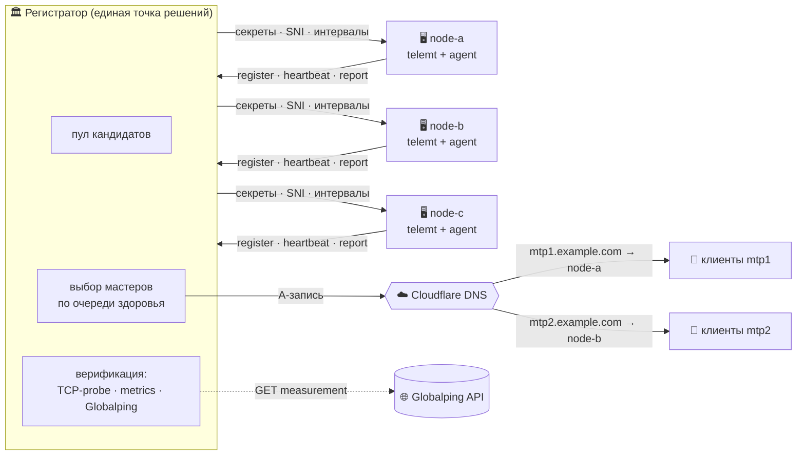

### Один пул — много мастеров

- В очередь мастерства встают только **полностью здоровые** ноды; место в очереди —
 по **непрерывному** здоровью (выбыл на минуту — в конец очереди).
- Доменов больше, чем здоровых нод — мастера **дотягивают «сирот»**: пустой
 A-записи не бывает. Поднялась свежая нода — один лишний домен мигрирует к ней
 (полной перебалансировки нет сознательно: стабильность дороже симметрии).
- Мастер падает → **только его домены** уходят наименее загруженным здоровым
 нодам. Все назначения переживают рестарт регистратора (state-файл).
- `master_ttl_minutes` — принудительная ротация по таймеру: домен уходит
 следующей ноде очереди, сдавший встаёт в конец. Отсчёт переживает рестарт,
 `0` = выключить, меняется из панели на лету.

### Модель здоровья: 4 сигнала

Нода — кандидат на мастерство, только если **все** сигналы зелёные:

| Сигнал | Кто проверяет | Как судится |
|---|---|---|
| 🔌 **TCP-probe** | регистратор, каждые `probe_interval_ms` | защёлка: `fail_threshold` подряд неудач → «вне строя», `recover_threshold` подряд удач → обратно |
| 🌐 **Globalping** | нода создаёт measurement, регистратор верифицирует | мгновенно: доля успешных РФ-проб ≥ 0.5, без защёлок — подтверждённо заблокированный мастер домену не нужен |
| 📈 **Metrics telemt** | нода читает `/metrics`, отчёт каждые `metrics_ms` | защёлка по серии отчётов — одиночный сетевой чих мастерство не роняет |
| 💓 **Свежесть отчёта** | регистратор | сторожевой таймер канала данных: heartbeat идёт, а health-отчёты не приходят дольше `report_freshness_min` — нода вне строя, иначе висела бы «зелёной» по устаревшим показаниям ([подробнее](#-faq)) |

### Жизненный цикл ноды

<p align="center">
 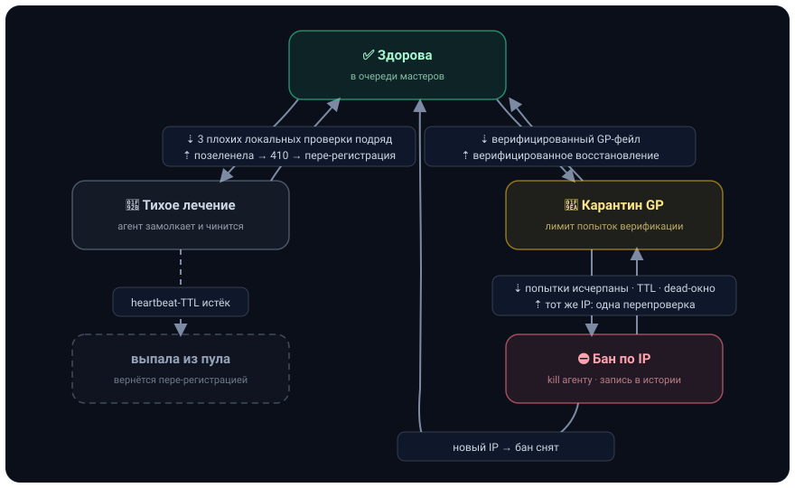
</p>

- **Карантин (GP)** — нода ещё в пуле, но вне очереди; регистратор продолжает
 её верифицировать. Финал попыток — **бан по IP**: агент получает kill-команду,
 пишет в лог ровно одну строку `Бан по ip, запустите службу заново после его смены`
 и останавливается. Выход из карантина со сменой IP засчитывает **старый** адрес
 как заблокированный (нода при этом живёт на новом).
- **Dead-класс** — TCP молчит и метрик нет дольше 10 минут: отдельный терминальный
 бан с текстом `Регистратор не достучался до порта и/или не получил метрики`.
- **Reverify** — честный второй шанс: переподключение с того же забаненного IP
 даёт одну решающую GP-проверку (позеленел — бан снят), повторная — только
 по кулдауну 15 минут. Защита от вечного цикла «410 → register → карантин → бан».
- **Бан в истории** — каждый первый бан адреса пишется в бессрочную SQLite-базу
 (питает `/dashboard`); перепроверки и «пустые» баны нод, не успевших поработать
 мастером, статистику не двигают.

<details>
<summary><b>Подробнее: тихое лечение на агенте — как нода не мусорит в журнал</b></summary>

Агент зеркалит проверки регистратора локально. 3 подряд неудачных scrape
`/metrics` telemt или 3 подряд conclusive-плохих Globalping-измерения —
агент **полностью замолкает** для регистратора (ни отчётов, ни heartbeat),
но продолжает проверять себя. Регистратор вычёркивает ноду по обычному
heartbeat-TTL за минуты, без окна рипера. Позеленела (2 подряд удачных
проверки) — молчание снято, первый heartbeat получает `410 Gone`, нода
пере-регистрируется и возвращается в пул сама. Разрежённые лечебные пробы
(раз в 15 минут) не жгут квоту Globalping по «трупу».

</details>

<details>
<summary><b>Подробнее: prune-карантин — защита от вертушки «упала → вернулась красной»</b></summary>

Нода, непрерывно нездоровая дольше `prune_unhealthy_min` (по умолчанию 60),
удаляется из пула и попадает в карантин регистрации: `/register` отвечает
`429 + Retry-After`. Серия подряд нарастает **15 мин → 30 мин → 1 ч → 2 ч → 3 ч**
(потолок) и обнуляется первым реальным входом в очередь здоровых. Совпадение
по IP тоже считается — переустановка агента с новым node_id на том же хосте
серию не отмывает.

</details>

<details>
<summary><b>Подробнее: DNS-экология — зачистка выведенных доменов</b></summary>

Домен, убранный из managed-списка, не остаётся мусором в зоне: регистратор
помнит все имена, которыми когда-либо управлял, и вычищает из Cloudflare ровно
разность «управляли раньше» \ «в конфиге сейчас» — только свои A/AAAA/CNAME,
TXT/MX/NS и чужие сервисы зоны не трогаются вообще.

</details>

---

## 🖥 Веб-интерфейсы

Страницы и публичные API отдаёт сам бинарник регистратора (никаких внешних
зависимостей — HTML+JS вшиты, данные приходят по JSON API, автообновление
каждые 5 с).

### Панель управления — `/panel`

Закрыта Bearer-токеном (`[panel] token`); одностраничное приложение с сайдбаром
и hash-роутингом. Путь: `https://<домен панели>/panel`, токен установщик кладёт
в `/etc/sharedd/credentials.txt`.

#### 1️⃣ Обзор

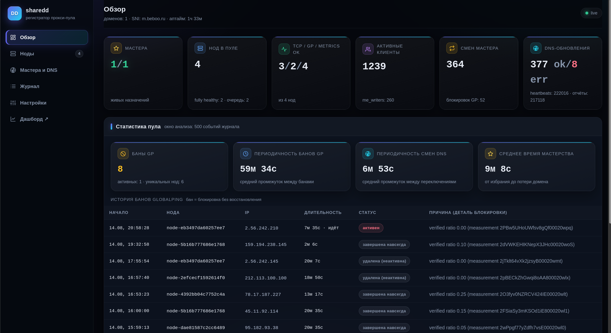
<!-- 📸 Снять: панель → «Обзор». docs/screenshots/panel-overview.png -->

- **Баннер тревоги** сверху — если что-то не так, видно сразу;
- **KPI-стрип**: живые назначения мастеров (N/M), нод в пуле, fully-healthy,
 размер очереди, активные клиенты (уникальные IP по метрикам telemt, только
 по общему секрету), кворум TCP/GP/Metrics-OK;
- **Статистика пула**: баны GP (всего / активных сейчас / уникальных нод),
 периодичность банов, периодичность смен DNS, среднее время мастерства,
 таблица истории банов (последние 15, с причиной и закрытием);
- **Мини-журнал** последних событий со ссылкой «весь журнал →».

#### 2️⃣ Ноды

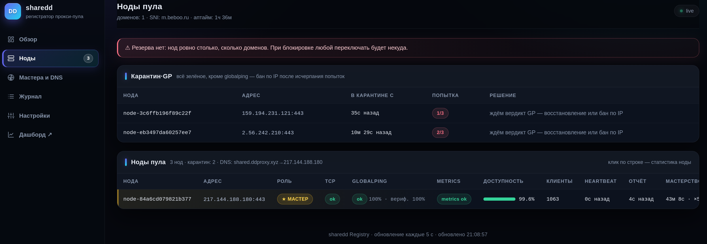
<!-- 📸 Снять: панель → «Ноды» (таблица пула). docs/screenshots/panel-nodes.png -->

Таблица пула в реальном времени: чипы TCP / Globalping / Metrics-защёлки,
доля успешных РФ-проб в последней верификации («посл.%»), исторический
«вериф.%» Globalping, позиция в очереди, **доступность %** за всю жизнь node_id,
возраст heartbeat/отчёта, суммарное время мастерства и число stint'ов,
клиенты (уникальные активные IP), бейдж типа ноды (**Classic / MEKO / MTProxyL**),
статус карантина, первая причина нездоровья. Клик по строке → страница ноды.

#### 3️⃣ Страница ноды

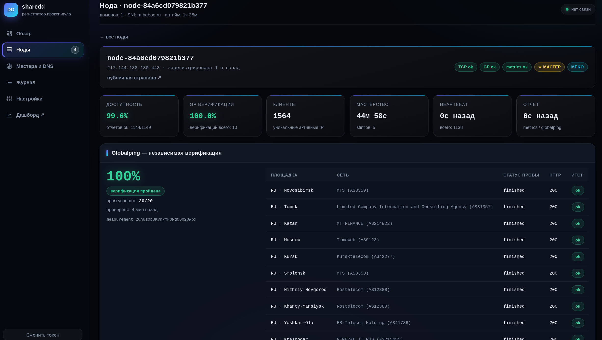
<!-- 📸 Снять: страницу любой ноды (чипы + GP по площадкам + графики).
 docs/screenshots/panel-node.png -->

- Статус-чипы и роль (мастер доменов / позиция в очереди), агрегаты здоровья;
- **Последняя Globalping-верификация по площадкам**: страна · город / сеть · AS /
 HTTP-код / итог по каждой пробе;
- Графики из кольцевых буферов регистратора: GP-ratio по верификациям (~24 ч),
 TCP-probe (~1 ч), metrics-отчёты (~6 ч), **интерактивный спарклайн клиентов**
 (курсор показывает точное время и число подключений);
- События именно этой ноды и ссылка на её **публичную страницу ↗**.

#### 4️⃣ Мастера и DNS

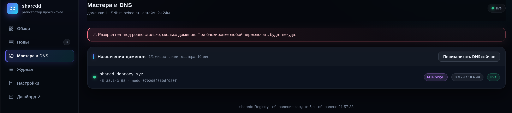
<!-- 📸 Снять: панель → «Мастера и DNS». docs/screenshots/panel-dns.png -->

Все домены с текущими мастерами, чип **«N / 30 мин»** до принудительной ротации
(или «TTL истёк», если здоровой замены пока нет), время в роли, кнопка ручного
**DNS-push** — немедленная перезапись A-записей каждого домена на IP его мастера.

#### 5️⃣ СРМД

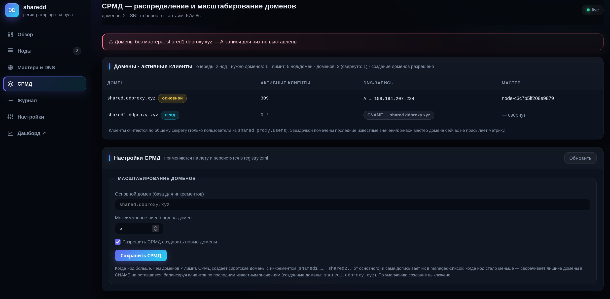
<!-- 📸 Снять: панель → «СРМД». docs/screenshots/panel-srmd.png -->

Система распределения и масштабирования доменов. Неоптимально держать все
ноды под одним доменом: у домена один мастер, остальные ноды очереди
простаивают. СРМД следит за соотношением здоровой очереди и числа доменов
(не больше `max_nodes_per_domain` нод на домен) и масштабирует пул доменов:

- **таблица «домен \| активные пользователи»** — текущие клиенты по общему
 секрету на мастерах доменов; когда живого мастера нет, хранится последнее
 известное значение (именно по нему балансируется сворачивание);
- **рост пула**: при включённом «Разрешить СРМД создавать новые домены»
 (по стандарту выключено) создаются сиротские домены с инкрементом от
 основного — `shared.ddproxy.xyz` → `shared1.ddproxy.xyz`, `shared2.…` —
 СРМД сама дописывает их в managed-список (персистится в `registry.toml`)
 и отдаёт в обычную селекцию мастеров. Если создание выключено, а нод
 слишком много в очереди — **алерт вверху экрана**;
- **сжатие пула**: нод стало меньше — лишние созданные домены сворачиваются
 в **CNAME** на оставшиеся, балансируя пользователей: крупные уходят
 наименее загруженным на данный момент (домены в ручном режиме не
 сворачиваются); ноды вернулись — свёрнутые сначала разворачиваются, и
 только потом создаются новые;
- **ручной ⇄ СРМД**: колонка «Управление» таблицы — кнопка **«под СРМД»**
 насильно переводит ручной домен под контроль системы (после этого он сможет
 сворачиваться в CNAME при сжатии пула), кнопка **«в ручной»** возвращает
 домен СРМД в ручной режим — СРМД его больше не сворачивает, а если домен
 свёрнут, он тут же разворачивается. Перевод фиксируется событиями
 `srmd_domain_taken` / `srmd_domain_released`.

Пример: лимит 3 ноды/домен, нод 10 → 4 домена; нод стало 4 → нужно 2 домена:
`shared2` сворачивается CNAME на `shared`, `shared3` — на `shared1`
(1400 клиентов уходят наименее загруженному), итог `shared` 2500 /
`shared1` 1780. Масштабирование случается только после ~минуты устойчивого
условия (анти-флап) и фиксируется событиями `srmd_domain_created` /
`srmd_domain_folded` / `srmd_domain_unfolded`.

#### 6️⃣ Журнал

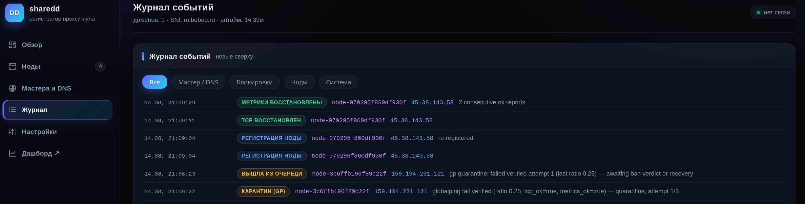
<!-- 📸 Снять: панель → «Журнал». docs/screenshots/panel-events.png -->

Единая лента: `node_registered` / `node_expired` / `node_pruned`,
`queue_joined` / `queue_left` (с причиной), `master_elected` / `master_lost`
(с доменом), `tcp_down/up`, `metrics_down/up`, вход/выход карантина,
`ip_blocked`, `node_terminated`, `ban_lifted`, `dns_updated` / `dns_error` /
`dns_deleted`, `config_changed`, старт регистратора. Фильтры: группы
(Все / Мастер·DNS / Блокировки / Ноды / Система), **тег-фильтр** по
конкретному типу события (`master_elected`, `dns_updated`, …) и **поиск по
ключевым словам** — все слова через пробел ищутся в типе/теге, node_id, IP,
домене и детали (регистр не важен), со счётчиком «найдено N из M».
Кольцевой буфер `events_max` (по умолчанию 500), **персистится в state-файл** —
переживает рестарт. Дополнительно зеркалится в SQLite: события — с ретенцией
по дням, баны — бессрочно.

#### 7️⃣ Настройки (hot-apply, без рестарта)

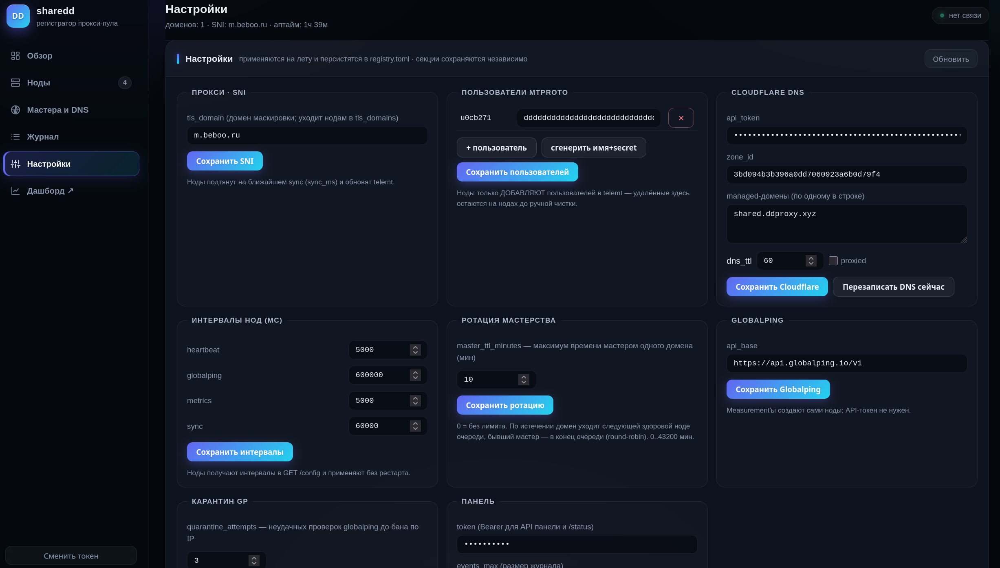
<!-- 📸 Снять: панель → «Настройки». docs/screenshots/panel-settings.png -->

Правятся на лету и **атомарно сохраняются обратно в `registry.toml`**
(предыдущая версия — в `.bak`):

| Блок | Что меняется |
|---|---|
| 🌐 **SNI** | Общий `tls_domain` маскировки — ноды подтянут на ближайшем sync и пропатчат telemt |
| 🔌 **Порт прокси** | Общий `shared_proxy.port` (по умолчанию 443); ноды с другим локальным портом не допускаются в пул, antiscan применяется только при совпадении |
| 👤 **Пользователи MTProto** | Пары `username = secret` (32 hex); добавления и ротация secret синхронизируются в `[access.users]` на нодах |
| ☁️ **Cloudflare DNS** | `api_token`, `zone_id`, managed-домены, `dns_ttl`, `proxied`; после сохранения — мгновенный пересчёт назначений и DNS-push |
| 🌍 **Globalping** | `api_base` (для зеркала API в тестах) |
| 🧪 **Карантин GP** | Число попыток до бана (`quarantine_attempts`, по умолчанию 3) |
| ⏱ **Ротация мастерства** | `master_ttl_minutes`; уменьшение ниже возраста мастера ротирует на ближайшем тике |
| ⏲ **Интервалы нод** | `heartbeat_ms` / `globalping_ms` / `metrics_ms` / `sync_ms` — раздаются через `/config` |
| 🔑 **Токен панели** | Мгновенная смена авторизации API и `/status` |

> Изменения помечаются событием `config_changed`. Тайминги `[healthcheck]`,
> `[http]`, `[state]` специально не вынесены в редактор — они вшиты в
> запущенные ticker'ы: файл + `systemctl restart sharedd-registry`.

### Публичная статистика нод — `/statistics`

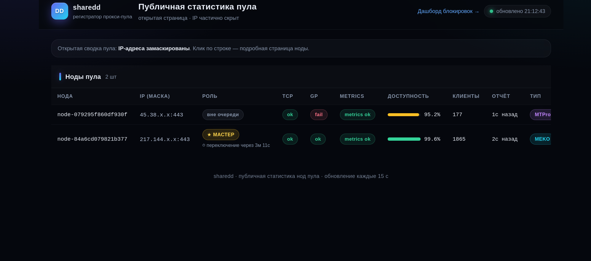
<!-- 📸 Снять: /statistics/<node_id>. docs/screenshots/statistics-node.png -->

Открытая копия страницы подробностей — можно давать пользователям без выдачи
панельного токена. Чувствительное вырезается **на сервере, до сериализации**:

- IP всюду маскирован (`203.0.x.x`), в том числе внутри текстов событий;
- `measurement_id` Globalping не отдаётся нигде (по нему открылся бы полный IP);
- события без адресов, причины нездоровья санитизированы.

Остальное — как в панели: чипы, графики, GP-верификации по площадкам,
доступность, спарклайн клиентов, **таймер до переключения мастера по TTL** —
«⏱ переключение через …» виден и в общем списке, и на странице ноды.
Общий список также содержит отдельную обезличенную таблицу GP-карантина:
замаскированный IP, причина, число попыток, последний ratio и время в карантине.

Маршруты: `GET /statistics` — список пула; `GET /statistics/<node_id>` — нода
(принимает и hex-суффикс без `node-`); JSON: `/statistics/api/list`,
`/statistics/api/node?id=…`.

### Дашборд пула — `/dashboard`

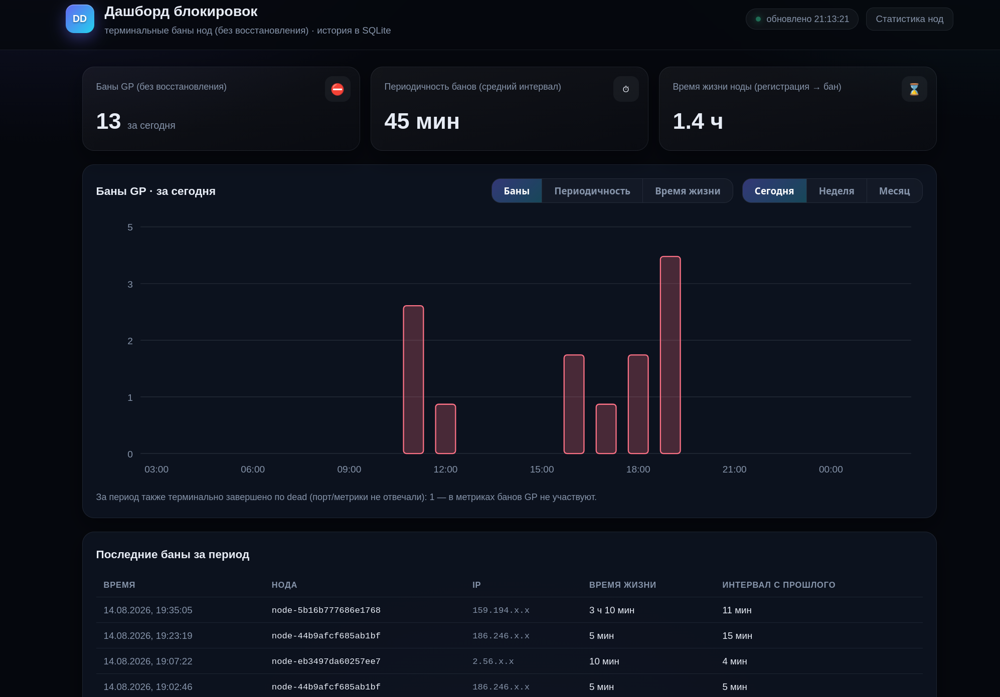
<!-- 📸 Снять: /dashboard (KPI + графики + таблица). docs/screenshots/dashboard.png -->

Публичная сводка по вечной SQLite-истории банов (не ограничена окном журнала):

- KPI: **баны**, **периодичность** (средний интервал между блокировками;
 всплески < 2 мин одного инцидента не считаются), **среднее время жизни ноды**
 (регистрация → бан);
- Графики по трём метрикам с диапазонами **Сегодня / Неделя / Месяц** —
 «Баны» барами, «Периодичность» и «Время жизни» цельными линиями;
- Таблица последних банов: время, нода, замаскированный IP, время жизни,
 интервал.
- Общий входящий, исходящий и суммарный трафик всех нод только по
  пользователям из `shared_proxy.users`, с историей за сегодня, 7 и 30 дней.

> В статистику попадают только баны нод, **успевших поработать мастером** —
> перепроверки старых адресов и «пустые» баны не накручивают счётчики.

### Прокси-ссылки — `/proxylinks`

Публичный JSON (без токена, как `/statistics`) с **актуальными** ссылками
`tg://proxy` для раздачи пользователям:

```json
{
  "links": [
    {
      "domain": "shared.ddproxy.xyz",
      "port": 443,
      "user": "u0cb271",
      "url": "tg://proxy?server=shared.ddproxy.xyz&port=443&secret=eedddddddddddddddddddddddddddddddd6d2e6265626f6f2e7275"
    }
  ]
}
```

Секрет ссылки — формат `ee` (fake-TLS MTProto): `ee` + секрет пользователя
из `shared_proxy.users` (32 hex) + общий SNI (`tls_domain`) в hex-ASCII
(`6d2e6265626f6f2e7275` = `m.beboo.ru`). Порт — реальный порт прокси мастера.

В список попадают **только домены со своим мастером**: домен `MASTER` —
в списке; домен, свёрнутый СРМД в CNAME, — не в списке, пока ему снова не
будет назначен мастер.

---

## 🚀 Установка

**Требования:** на серверах — только systemd и сеть (бинарники статические);
для сборки — Go 1.26+.

```bash
./scripts/build_all.sh # собрать оба компонента → dist/ (архивы + голые бинарники)
```

### Регистратор (с Caddy, HTTPS и панелью — рекомендуется)

A-запись домена панели должна указывать на сервер (для ACME нужны 80/443).

```bash
tar xzf dist/sharedd-registry-*-linux-amd64.tar.gz
sudo bash pkg/install_full.sh # интерактивно: FQDN, CF token/zone, домены, SNI
# или неинтерактивно:
sudo bash pkg/install_full.sh --domain ha.example.com --email admin@example.com \
 --cf-token XXX --cf-zone YYY --cf-domains mtp1.example.com,mtp2.example.com \
 --tls-domain www.microsoft.com
```

**Или одной командой из релиза** — бинарник скачивается с GitHub Release, дальше
работает тот же полный установщик:

```bash
curl -fsSL https://raw.githubusercontent.com/ugDeDe/sharedd/main/scripts/install_registry_web.sh | sudo bash
```

Установщик ставит Caddy (apt/dnf репозиторий → fallback статический бинарник),
пишет `registry.toml`, `Caddyfile` и systemd-юниты, автоматически генерирует
секрет первого пользователя, **токен панели** и обязательный **Node API token**.
В финале он печатает готовую команду подключения ноды с уже подставленными URL
и токеном. Та же команда хранится как `node_install_command` в
`/etc/sharedd/credentials.txt` (0600). При повторном запуске установщик берёт
токены из действующего `registry.toml`, поэтому не показывает новые
неработающие значения.
Если Caddy недоступен — регистратор всё равно поднимается на `0.0.0.0:8080`,
доставить HTTPS позже: `sudo bash pkg/install_full.sh --only-caddy --domain <fqdn>`.

### Нода (одна готовая команда на каждый VPS)

Рекомендуемый сценарий: скопируйте команду из финала установки регистратора
или из **Панель → Настройки → Доступ → Подключить ноду** и запустите на VPS.
Команда полностью неинтерактивна, передаёт обязательный Node API token и сама
записывает `registry.url` и `registry.token` в `node.toml`; вручную редактировать
конфиг не нужно.

```bash
tar xzf dist/sharedd-node-agent-*-linux-amd64.tar.gz
sudo bash pkg/install_full.sh # URL регистратора (Enter = дефолт), путь telemt — авто
# явные пресеты:
sudo bash pkg/install_full.sh --preset classic # /etc/telemt/telemt.toml
sudo bash pkg/install_full.sh --preset mtproxyl # MTProxyL superexpert (режим включится сам)
```

Или web-установка голым бинарником из релиза:

```bash
curl -fsSL https://raw.githubusercontent.com/ugDeDe/sharedd/main/scripts/install_node_web.sh | sudo bash -s -- \
  --registry=https://registry.example.com \
  --registry-token=NODE_API_TOKEN
```

При таком обычном ручном запуске установщик запросит Node API token. Без токена
публичного auto-discovery нет: возьмите готовую команду или токен в защищённой
панели. Токены при первичной установке регистратора создавать вручную не нужно.

Агент автоматически поддерживает antiscan: каждые 30 минут атомарно обновляет
`ipset` из публичного списка `stamparm/ipsum` и блокирует эти адреса в собственной
цепочке `ANTISCAN_MTPROTO`. TTL-фильтрация не используется. Общий порт задаётся
как `shared_proxy.port` на регистраторе (по умолчанию `443`); установщик
прерывается, если фактический порт telemt/MTProxyL с ним не совпадает.

ID ноды всегда имеет формат `имя-хеш`: имя длиной `1..10` символов и случайный
суффикс из 5 символов `a-z0-9`, например `helsinki-6an4o`. Без `--name` используется
имя `node`. Старые ID автоматически мигрируют при первом запуске нового агента.

Установщик ноды **сам выполняет конвейер применения конфига до старта демона**:
fetch `/config` → стоп прокси → атомарный патч `telemt.toml` → старт → ожидание
`/metrics` → откат при провале. Прокси гарантированно возвращается в работу
при любом сбое.

**Проверка после установки:**

```bash
systemctl status sharedd-node-agent # на ноде
journalctl -u sharedd-node-agent -f # регистрация, первый globalping
```

---

## 🔧 Конфигурация

Полные образцы с комментариями: [`configs/registry.example.toml`](configs/registry.example.toml),
[`configs/node.example.toml`](configs/node.example.toml). Ключевые ручки:

| Ключ | По умолчанию | За что отвечает |
|---|---|---|
| `[security] node_token` | обязателен | Общий Bearer-токен machine-to-machine API (`/register`, `/heartbeat`, `/report`, `/retire`, `/config`) |
| `[healthcheck] fail/recover_threshold` | 3 / 2 | Серии до гашения/возврата ноды (TCP и metrics-защёлки) |
| `[healthcheck] report_freshness_min` | 15 | Агент жив (heartbeat есть), но не присылает health-отчёты → нода снимается из строя. Отличие от `heartbeat_ttl_sec` — [в FAQ](#-faq) |
| `[healthcheck] globalping_validity_min` | 15 | Срок годности независимо проверенного GP-результата. Должен быть строго больше `node_defaults.globalping_ms`; просрочка отправляет ноду в карантин и запрашивает внеочередную проверку. |
| `[healthcheck] prune_unhealthy_min` | 60 (0 = выкл) | Рипер непрерывно нездоровых из пула |
| `quarantine_attempts` | 3 | Неудачных верифицированных GP-проверок до бана |
| `[rotation] master_ttl_minutes` | 30 (0 = выкл) | Принудительная ротация мастеров по таймеру |
| `[node_defaults] heartbeat/globalping/metrics/sync_ms` | 15с / 5м / 60с / 60с | Тайминги, раздаваемые агентам через `/config` |
| `[panel] token` | — | Обязательный Bearer для панели и `/status` (минимум 16 символов) |
| `[panel] public_url` | — | Доверенный публичный origin регистратора для onboarding-команды; `Host` запроса не используется |
| `[cloudflare] domains` | — | Managed-домены: у каждого свой мастер |
| `[srmd] enabled` | false | Разрешить СРМД создавать новые домены при росте пула |
| `[srmd] base_domain` | первый из `cloudflare.domains` | Основной домен — база инкрементов (`shared` → `shared1`, `shared2`…) |
| `[srmd] max_nodes_per_domain` | 5 | Максимум нод на домен: очередь больше — СРМД масштабирует домены |

`node.toml` на агенте содержит URL и тот же обязательный node API token; всё
остальное нода получает с регистратора:

```toml
[registry]
url = "https://ha.example.com"
token = "PASTE_THE_SAME_LONG_RANDOM_TOKEN"

[telemt]
config_path = "/etc/telemt/telemt.toml"

[sync]
apply_to_telemt = true
```

### Миграция node API token

Начиная с P0 security регистратор и агент **не запускаются с пустым токеном**.
Перед обновлением сгенерируйте общий секрет, например `openssl rand -hex 32`, и
сначала добавьте его на регистратор:

```toml
[security]
node_token = "<generated-token>"
```

Затем добавьте то же значение в `/etc/sharedd/node.toml` каждой ноды:

```toml
[registry]
url = "https://ha.example.com"
token = "<generated-token>"
```

После раскатки перезапустите регистратор и агенты. Ротация выполняется так же и
требует согласованного короткого окна перезапуска, поскольку одновременно два
node-токена не принимаются. Старые вручную заданные node ID должны иметь формат
`node-` плюс 16 строчных hex-символов; при несовместимом ID удалите
`/var/lib/sharedd/node_id`, чтобы агент сгенерировал корректный случайный ID.

---

## ❓ FAQ

<details>
<summary><b>Нода пропала из пула — что случилось?</b></summary>

Чаще всего это не смерть агента, а **тихое лечение**: локальные проверки
ноды красные → агент замолчал, регистратор вычеркнул её по heartbeat-TTL.
Смотрите лог ноды (`entering SILENT HEALING mode` / `silent healing over`).
Как только прокси позеленеет — нода сама вернётся в пул пере-регистрацией.
Если лога про silent-режим нет — проверяйте `systemctl status sharedd-node-agent`
и сеть до регистратора.

</details>

<details>
<summary><b>Зачем нужен <code>report_freshness_min</code>, если молчунов удаляет <code>heartbeat_ttl_sec</code>, а неблагонадёжных чистят prune и карантин?</b></summary>

Они сторожат **разные каналы**. Heartbeat (каждые 15 с) — «процесс агента жив»:
нет heartbeat дольше `heartbeat_ttl_sec` (60 с) → запись удаляется из пула.
Отчёт (каждые `metrics_ms`) несёт **доказательства** «прокси здоров»: вердикт
metrics и id GP-измерения. Защёлки здоровья двигаются только отчётами — поэтому
если отчёты перестали приходить вовсе (завис цикл метрик агента, сломана доставка),
защёлка застывает в последнем значении, и без freshness нода с последними
зелёными отчётами осталась бы «здоровой» навсегда: TCP-порт проба регистратора,
может, и видит, а вот что telemt внутри умер (нет активных writers), видно только
из отчётов. Итого деление труда: молчит агент целиком → `heartbeat_ttl_sec`;
жив агент, но молчит канал данных → `report_freshness_min` снимает ноду из строя
(запись в пуле остаётся, причина «health report stale»); непрерывное нездоровье
дольше `prune_unhealthy_min` → удаление рипером; GP-карантин и бан — отдельный
терминальный класс по внешней верификации.

</details>

<details>
<summary><b>Что делать при «Бан по ip, запустите службу заново после его смены»?</b></summary>

IP заблокирован для РФ-площадок (это подтверждено внешними пробами
Globalping, а не самоотчётом). Два пути: **1)** сменить IP хоста и запустить
службу заново — регистрация с нового адреса снимает бан мгновенно;
**2)** если уверены, что блок был ложным, запустите службу на том же IP —
регистратор даст одну решающую GP-перепроверку; позеленела — бан снят
(`ban_lifted`), нет — бан возвращается навсегда (следующий шанс — через
15 минут кулдауна).

</details>

<details>
<summary><b>Почему в /dashboard банов меньше, чем завершённых нод в журнале?</b></summary>

Это политика, а не рассинхрон. В статистику попадают только баны нод,
**успевших поработать мастером** — то есть баны, которые реально задели
пользователей. Перепроверки старых забаненных адресов (reverify), гибель
свежей ноды в карантине до первого назначения и retire уже выпавших нод
счётчики не двигают: бан адреса уже был учтён при первом бане.

</details>

<details>
<summary><b>Нужен ли API-токен Globalping?</b></summary>

Нет, сознательно. Почасовые квоты Globalping (250 тестов/час анонимно)
относятся к **созданию** измерений — это делают сами ноды со своих IP,
и токен регистратора их квоты не поднял бы. Регистратор лишь **скачивает
результаты** GET'ом для независимой верификации — почасовой квоты на GET
нет. При дефолтном интервале 5 минут нода тратит 20 проб × 12/час ≈ 240
тестов/час — впритык к лимиту, зато без ключей и учёток вообще.

</details>

<details>
<summary><b>Как удалить пользователя MTProto?</b></summary>

Панель умеет **добавлять** пользователей на ноды (add-only патч
`[access.users]` — записи с другими именами не перезаписываются). Удаление —
вручную на нодах: уберите username из `[access.users]` в `telemt.toml`
и перезапустите прокси. Правку в панели сделайте тоже, чтобы регистратор
не вернул юзера обратно на ближайшем sync.

</details>

<details>
<summary><b>MTProxyL и/или MEKO fix поддерживается?</b></summary>

Да. Агент детектит тип установки: ванильный telemt,
MEKO, MTProxyL Manager. Для MTProxyL Manager агент
патчит **superexpert-конфиг**; режим супер-эксперта
установщик включает автоматически. Тип ноды показывается бейджом в панели.

</details>

<details>
<summary><b>Что будет, если упадёт сам регистратор?</b></summary>

Ничего страшного в короткой перспективе: A-записи остаются на последних
мастерах, прокси продолжают обслуживать клиентов, агенты терпеливо ретраят
register/heartbeat. Не будет только переключений при новых падениях, ротации
по таймеру и конфиг-апдейтов. После возвращения регистратор поднимет state
(назначения, очередь, журнал, TTL-отсчёты переживают рестарт) и догонит
картину. Это осознанный трейд-офф простоты: один регистратор вместо etcd/Raft.

</details>

<details>
<summary><b>Чем «Клиенты» отличаются от me_writers в панели?</b></summary>

`telemt_me_writers_active_current` — это апстрим-подключения telemt к Telegram
middle-end (пул райтеров), а не люди: число держится и без единого пользователя.
Колонка «Клиенты» — сумма per-user серий `telemt_user_unique_ips_current`:
уникальные активные клиентские IP. Считаются они **только по общему секрету**:
в сумму входят лишь серии пользователей, которых раздаёт регистратор
(`shared_proxy.users`, метрика вида `telemt_user_unique_ips_current{user="u0cb271"}`);
локальные юзеры ноды не учитываются. Если нода не присылает per-user метрики
(выключено в telemt `[general.telemetry] user_enabled`), панель честно рисует
`—`, а не фейковый ноль.

</details>

<details>
<summary><b>Что такое СРМД и когда она создаёт новые домены?</b></summary>

Система распределения и масштабирования доменов (вкладка «СРМД» панели).
У домена один мастер, и когда нод заметно больше, чем доменов ×
`[srmd] max_nodes_per_domain` (по умолчанию 5), очередь мастерства
переполнена. Дальше два сценария: создание доменов **выключено**
(по стандарту) — панель просто даёт алерт «нод слишком много в очереди»;
**включено** — СРМД после ~минуты устойчивого превышения создаёт сиротские
домены с инкрементом от основного (`shared.ddproxy.xyz` →
`shared1.ddproxy.xyz`, `shared2.…`), сама дописывает их в
`cloudflare.domains` и раздаёт им мастеров как обычно. Когда нод стало
меньше, лишние созданные домены не удаляются, а сворачиваются в CNAME на
оставшиеся (балансируя по последним известным числам активных клиентов) —
клиенты продолжают ходить по старому имени. Разворачивание/создание обратно
тоже автоматические. Активные клиенты по доменам считаются только по общему
секрету.

</details>

<details>
<summary><b>Как часто переключаются мастера? Можно ли отключить ротацию?</b></summary>

Два механизма: мгновенное переключение при потере здоровья/блокировке и
принудительная ротация по `[rotation] master_ttl_minutes` (по умолчанию 30 мин;
отсчёт переживает рестарт регистратора). Сдавший домен уходит в конец очереди —
нагрузка равномерно размазывается по пулу. Отключение: `0` в конфиге или панели.
Сколько осталось до ротации конкретного домена — видно чипом на вкладке
«Мастера и DNS» и на публичной странице `/statistics`.

</details>

<details>
<summary><b>Безопасно ли давать ссылки /statistics и /dashboard пользователям?</b></summary>

Да, они для этого и сделаны. Обе страницы открыты без токена, но выдача
обезличивается **на сервере**, до JSON: IP маскирован до двух октетов
(`203.0.x.x`) включая тексты событий, `measurement_id` не отдаётся вообще,
перечня секретов/настроек там нет. Выключаются тем же рубильником
`[panel] enabled = false`.

</details>

<details>
<summary><b>Где взять актуальные tg://proxy-ссылки для пользователей?</b></summary>

`GET /proxylinks` — публичный JSON со ссылками по всем доменам, у которых
сейчас есть свой мастер (свёрнутые СРМД в CNAME домены не показываются, пока
не получат мастера). Секрет — формат `ee`: `ee` + секрет пользователя +
SNI-домен в hex-ASCII; порт берётся реальный с мастера. Ссылки всегда
актуальны: при переключении мастеров/сворачивании доменов список
пересчитывается сам.

</details>

<details>
<summary><b>Можно ли сменить SNI-маскировку на лету?</b></summary>

Да: панель → Настройки → SNI. Регистратор применяет мгновенно и персистит
в `registry.toml`; ноды подтягивают новое значение на ближайшем sync
(`sync_ms`, по умолчанию минута), патчат конфиг и перезапускают прокси по
конвейеру с откатом. Если в `[censorship]` telemt стоит явный `mask = true`,
агент дополнительно держит маппинг актуального SNI на самого себя — на активное
прощупывание отдаётся контент **настоящего** сайта.

</details>


<details>
<summary><b>«metrics: connection refused» на свежей ноде</b></summary>

telemt ещё не поднял `/metrics` после автодописки `metrics_listen` —
перезапустите прокси: `systemctl restart telemt` (установщик это делает сам,
в ручных раскладках — руками). Если ругается `metric telemt_me_writers_active_current
not found` — у вас другая сборка telemt с иными именами метрик, сверьте
`curl 127.0.0.1:9090/metrics`.

</details>

<details>
<summary><b>Как обновить sharedd до новой версии?</b></summary>

Сборка и установка идемпотентны, просто повторите процесс установки.

</details>

<details>
<summary><b>Сколько нод и доменов выдержит пул?</b></summary>

Практический потолок упирается в квоты и темп проверок, а не в код:
Globalping ~240 тестов/час **с ноды** (хватит на любой пул — измерения
создают сами ноды), heartbeat 15 с и metrics 60 с с ноды — десятки байтов.
Пул в десятки нод и десяток доменов — штатный режим. Горячее членство живёт
в памяти + JSON-стейте, факты (события/баны) — в SQLite; это осознанный
выбор в пользу простоты эксплуатации против «эталонного» хранилища.

</details>

---

<div align="center">
<sub>sharedd · MTProto HA pool · telemt · MTProxyL/MEKO · Cloudflare DNS · Globalping-verified</sub>
</div>
